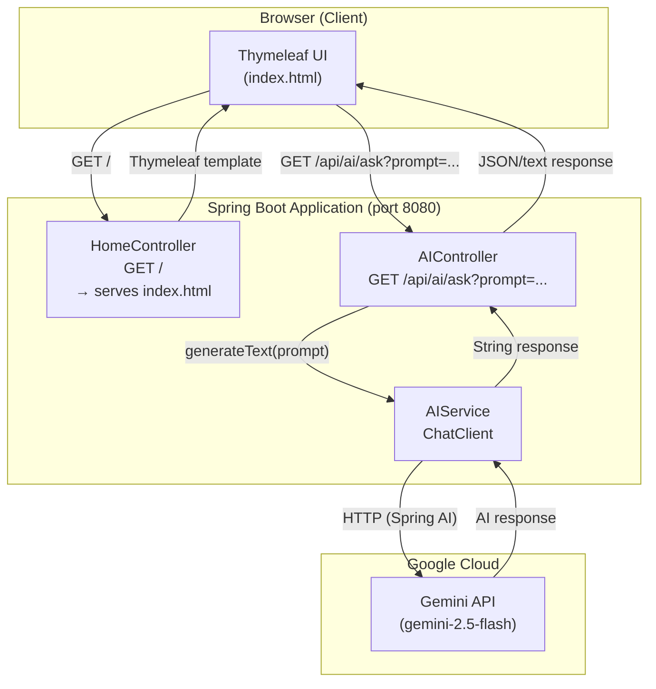

# Spring AI Demo — Google Gemini

A Spring Boot application demonstrating Spring AI integration with Google Gemini.

---

## High-Level Design



### Component Responsibilities

| Component | Role |
|---|---|
| `HomeController` | Serves the Thymeleaf web UI at `GET /` |
| `AIController` | REST endpoint — accepts a `prompt` query param, returns AI-generated text |
| `AIService` | Wraps Spring AI `ChatClient`; sends the prompt to Google Gemini and returns the response |
| `Gemini API` | External LLM (gemini-2.5-flash) hosted on Google Cloud; performs text generation |

---

## UI

The application serves a clean single-page chat interface at `http://localhost:8080`.

### Initial state

```
┌──────────────────────────────────────────────────────────────┐
│  Spring AI Demo  [Gemini]                                    │
│                                                              │
│  Ask anything                                                │
│  ┌────────────────────────────────────────────────────────┐  │
│  │ e.g. Explain Spring AI in simple terms...              │  │
│  │                                                        │  │
│  │                                                        │  │
│  └────────────────────────────────────────────────────────┘  │
│                                                              │
│  [ Ask Gemini ]                                              │
└──────────────────────────────────────────────────────────────┘
```

### While waiting for a response

```
┌──────────────────────────────────────────────────────────────┐
│  Spring AI Demo  [Gemini]                                    │
│                                                              │
│  Ask anything                                                │
│  ┌────────────────────────────────────────────────────────┐  │
│  │ What is Spring AI?                                     │  │
│  └────────────────────────────────────────────────────────┘  │
│                                                              │
│  [ Ask Gemini ]  (disabled)                                  │
│                                                              │
│  ↻  Thinking…                                               │
└──────────────────────────────────────────────────────────────┘
```

### Response state

```
┌──────────────────────────────────────────────────────────────┐
│  Spring AI Demo  [Gemini]                                    │
│                                                              │
│  Ask anything                                                │
│  ┌────────────────────────────────────────────────────────┐  │
│  │ What is Spring AI?                                     │  │
│  └────────────────────────────────────────────────────────┘  │
│                                                              │
│  [ Ask Gemini ]                                              │
│                                                              │
│  ┌────────────────────────────────────────────────────────┐  │
│  │ Spring AI is a framework within the Spring ecosystem   │  │
│  │ that simplifies building AI-powered applications by    │  │
│  │ providing a consistent, Spring-friendly API for        │  │
│  │ interacting with various AI models and providers…      │  │
│  └────────────────────────────────────────────────────────┘  │
└──────────────────────────────────────────────────────────────┘
```

> **Tip:** Press `Ctrl+Enter` (or `Cmd+Enter` on macOS) inside the textarea to submit without clicking the button.

---

## Step 1: Create a Gemini API Key

1. Go to [Google AI Studio](https://aistudio.google.com/app/apikey)
2. Sign in with your Google account
3. Click **"Create API key"**
4. Copy the generated API key

---

## Step 2: Configure the API Key

Open `src/main/resources/application.properties` and set your key:

```properties
spring.application.name=spring-ai-demo
spring.ai.google.genai.api-key=YOUR_GEMINI_API_KEY
spring.ai.google.genai.chat.options.model=gemini-2.5-flash
```

> **Tip:** Avoid committing your API key to source control. Use an environment variable instead:
> ```properties
> spring.ai.google.genai.api-key=${GEMINI_API_KEY}
> ```
> Then set it in your shell: `export GEMINI_API_KEY=your_key_here`

---

## Step 3: Run the Application

```bash
mvn clean install
mvn spring-boot:run
```

The application starts on `http://localhost:8080`.

---

## Step 4: Test the API

Send a GET request with a prompt:

```bash
curl "http://localhost:8080/api/ai/ask?prompt=What+is+Spring+AI?"
```

Or open in a browser:

```
http://localhost:8080/api/ai/ask?prompt=Hello
```

---


